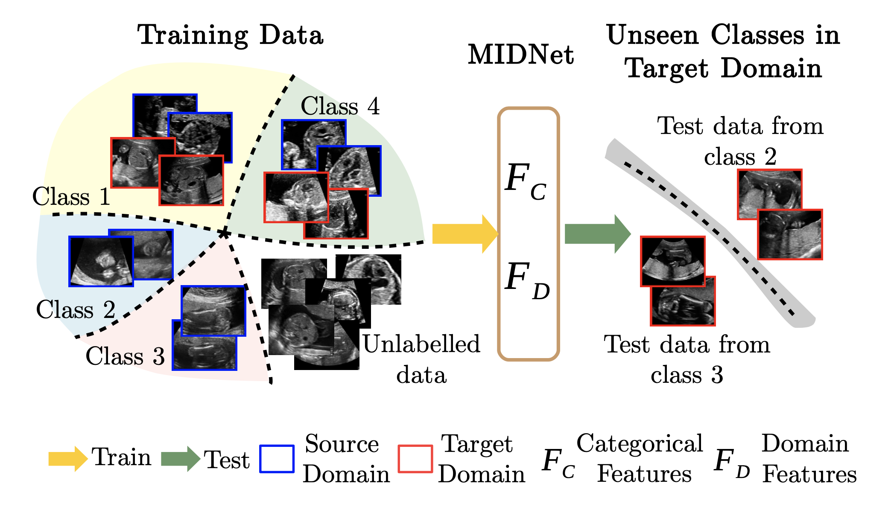
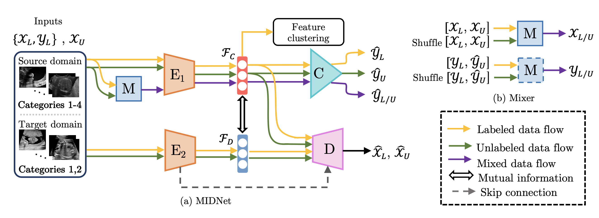

# mutual-information-based-disentangled-neural-networks
Code for paper ''Mutual Information-based Disentangled Neural Networks for Classifying Unseen Categories in Different Domains: Application to Fetal Ultrasound Imaging' 
<br>
**Code is coming soon...**

<p align="center">
    
</p>
<p align="center">
    
</p>

```
@article{meng2020MIDNet,
 author = {Qingjie Meng and Jacqueline Matthew and Veronika A. Zimmer and Alberto Gomez and David F. A. Lloyd and Daniel Rueckert and Bernhard Kainz},
 title = {Mutual Information-based Disentangled Neural Networks for Classifying Unseen Categories in Different Domains: Application to Fetal Ultrasound Imaging},
 journal = {IEEE Transactions on Medical Imaging},
 month = Novermber,
 year = {2020},
 issn = {0278-0062},
 publisher = {IEEE},
}
```
If you make use of the code, please cite the paper in any resulting publications.
